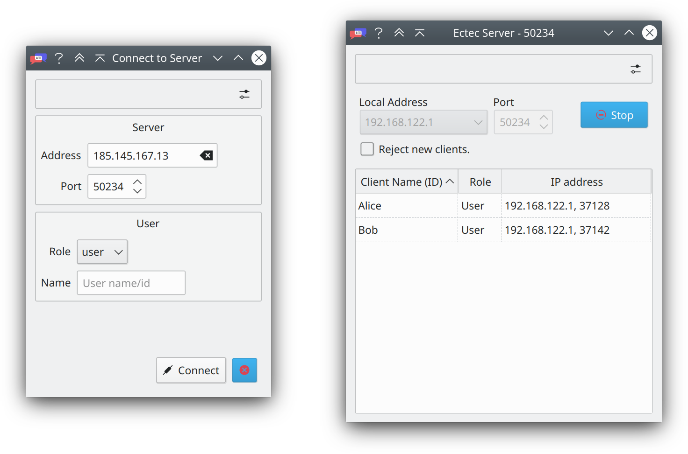
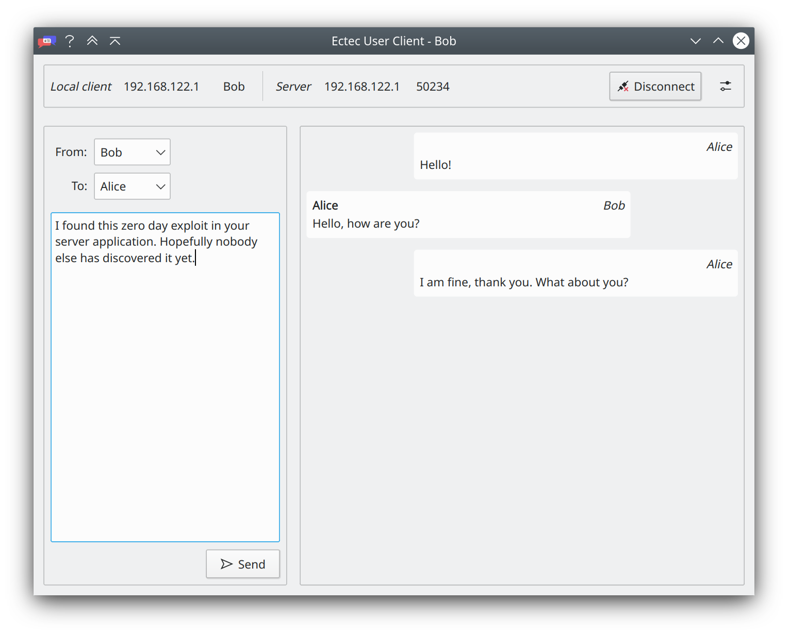

<div align="center">
    <h1>
    
    <div>ectec</div>
    </h1>
    <p><sup>
    A educational chat tool for learning how encrypted communication works
    </sup></p>
</div>
<br>
<br>
<!-- Preview of the GUI -->
<div align="center">
    <div></div>
    <div></div>
</div>

## Installation

You can install the ectec GUI as a python package/distribution or as a
standalone compiled executable. Both installation methods are explained in the following.
If you want to build ectec from source instead refer to the instructions
in `python/ectec-gui/README.md`.

### Install as a python package

First you will need to install a recent version of
[Python](https://www.python.org/) *(>=3.7)* including the pip package installer.
Then head to the latest release of this repository. Download either
the wheel distribution named `ectec-<version>.whl` or the sdist distribution
named `ectec-<version>.tar.gz`.
Open a terminal in the folder you downloaded the
distribution to.
Run the following with the file name of the archive you just downloaded:

```bash
> pip3 install <distribution file name>
```

After that you launch the two GUI programs with the commands `ectecgui-client`
and `ectecgui-server`.

### Install as standalone executable

This distribution doesn't require installing python since all dependencies
including python are contained in this distribution. The distribution contains
compiled files and two platform specific executables that start the GUI.
Therefore there are three different versions of this distribution - one for
each common operating system: Linux, Windows and MacOS.
To get started you simply have to download the archive for your OS and
extract its contents. There you will find the executables that launch the app.
This installation method doesn't install the application system-wide but
instead supplies a portable version of the app that is contained in one
folder.


## User Guide

The chattool consists of two programs (graphical user interfaces).
One of them starts a server that the other program (called client)
can connect to. All clients connected to the same server can exchange
messages. A client can connect to a server on the same machine or on a
different one. If one wants to connect to a remote server, one has to
know the ip address and the port the server is running on. They are
displayed in the server program (GUI).

The client GUI allows sending the messages to the other server. The messages
are passed to the server that forwards them to the other clients. A message
consists of a body with text one or multiple receivers and a sender.
A client sending a message can't be sure that only the specified receivers
receive/read the message. A receiver cannot be sure that it actually originates
from the specified sender. That seems impractical for a chat tool.
However, this is how the internet works and this chat tool tries to simulate the internet.

## Features and Roadmap

Currently the tool only supports limited functionality. One can connect to a server, send and receive messages. The user can specify different senders and receivers for a sent message. The server is able to list connected clients, block new incoming connections when the option is selected and kick clients from the server. This feature set is not sufficient for learning how encrypted communication works. However this project is under continous development. The planned features and their order as well as timely scope of implementation are laid out in the [roadmap](./plan/ROADMAP.md).

## Issues and Contributing

If the program raises an error, something doesn't work as expected or you
just found something that could be improved, you're welcome to submit an
issue report on the repository page of this project
that can be found on [Github](https://github.com/real-yfprojects/ectec).

When opening an issue choose the appropriate template (bug report, feature request, …). Other types of feedback for which no template exists are welcome
nonetheless. Then fill in the template. You may omit some parts of it but the
templates usually request the information actually needed for solving an issue.

Contributions to this project are accepted with thanks.
If you want to help, you have many possibilities: coding, writing
documentation or guides, testing or just giving feedback.

## Copyright and Licensing

Copyright and licensing information can be found in the file `LICENSE` which should be in the same folder as this file.
